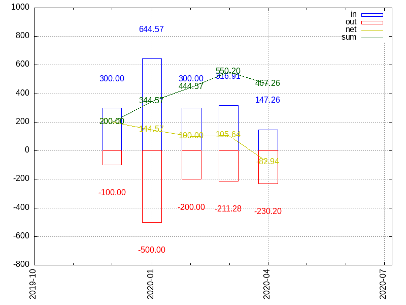

nummi
=====

Amateur accounting software.


Database
--------

Transactions are stored in one or more text files.  No directory structure is
enforced other than files having the `.txt` extension and being concatenated in
lexicographical order.

Each file contains one transaction per line.  The format of each entry is:

```
<date> <amount><currency> <tag> <description>
```

e.g.:

```
2020-04-19 -100.00eur t description
```

- `date`: Date of the transaction in ISO 8601 format (i.e. `%Y-%m-%d`).  No
  timezone information is encoded, Dates are always assumed to be in the
  machine's current timezone.
- `amount`: Monetary value in decimal notation.
- `currency`: Three-letter ISO 4217 code for the currency of the value in
  `amount`.
- `tag`: A single character tag used for grouping entries.  Values are
  arbitrary and have no specific meaning.
- `description`: A textual description attached to the transaction.

Field in the entry should be separated by one space character, except for
`amount` and `currency`, which have no space in between, and `description`,
which consumes the entire rest of the line.

Processing of each file stops at the first blank line.  The remaining content
is completely ignored, so extra information can be added.


Commands
--------

See `nummi --help` for a summary of the command line arguments and available
commands.


### `list`

The default command when none is specified is to list all entries in the
database.


### `currencies`

Lists all unique currencies from all entries.


### `update-cache`

Force an update of the currency exchange cache file ([see
below](#currency-conversion)).


### `plot`

Generate a `gnuplot` graphic summarizing the historical values in the database.
Each entry is converted to EUR ([see below](#currency-conversion)) and a
monthly total is calculated.  Bars show the monthly income and expense, lines
show the discrete and accumulated net values.

```
2019-12-01 300.00eur a entry0
2019-12-01 -100.00eur a entry1
2020-01-01 700.00usd a entry2
2020-01-02 -500.00eur a entry3
2020-02-01 -200.00eur a entry4
2020-02-01 300.00eur a entry5
2020-03-01 -1200.00brl a entry6
2020-03-01 1800.00brl a entry7
2020-04-01 4000.00czk a entry8
2020-04-01 -250.00usd a entry9
```




Currency conversion
-------------------

In order to summarize entries in different currencies the exchange rates from
the [European Central Bank](https://www.ecb.europa.eu) is downloaded and cached
locally (in `$XDG_CACHE_HOME/nummi/currencies`, TTL: 1d).  Values in the
database entries are then converted to EUR (note: this is a gross
simplification and in no way an attempt to be a financially sound tool).
